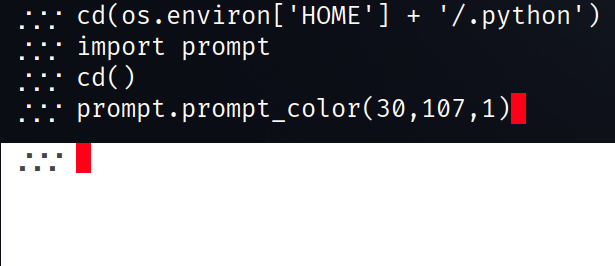
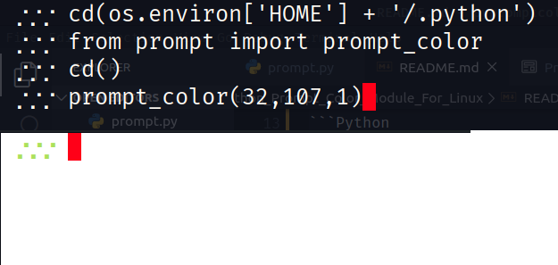
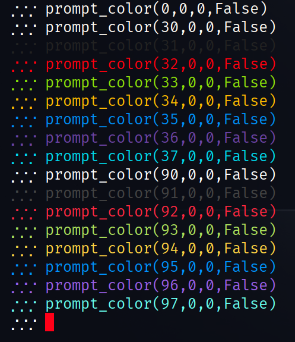

# Python Prompt Color Module For Linux

'prompt' is a module for Linux Python interpreter that helps with manipulating the interpreters prompt. I will be adding features, but for the time being the only feature is 'prompt_color'&#59; a way to change the foregorund &amp; background colors with a couple of features.

## Updates

- Added 'prompt_color' function
  - Change foreground color
  - Change background color
  - Change style effect
  - Clear the screen, useful for setting background

- Added 'cd' function
  - Change directory
  - Defaults to $HOME

## USAGE

This module can be imported from file and/or the function can be stripped &amp; used in your script.

## Help

")

")

## Import examples

### Import Full

```Python
import prompt
prompt.prompt_color(90,107,1)
```



### Import prompt_color only

```Python
from prompt import prompt_color
prompt_color(90,107,1)
```



## Full Foreground List



## Motivation

I wanted a quicker way to change the Python interperter prompt color.

## License GPLV3

This license file: [LICENSE](LICENSE "GPLV3 License File")

```LICENSE
    This program is free software: you can redistribute it and/or modify
    it under the terms of the GNU General Public License as published by
    the Free Software Foundation, either version 3 of the License, or
    (at your option) any later version.

    This program is distributed in the hope that it will be useful,
    but WITHOUT ANY WARRANTY; without even the implied warranty of
    MERCHANTABILITY or FITNESS FOR A PARTICULAR PURPOSE.  See the
    GNU General Public License for more details.

    License provided in LICENSE file
